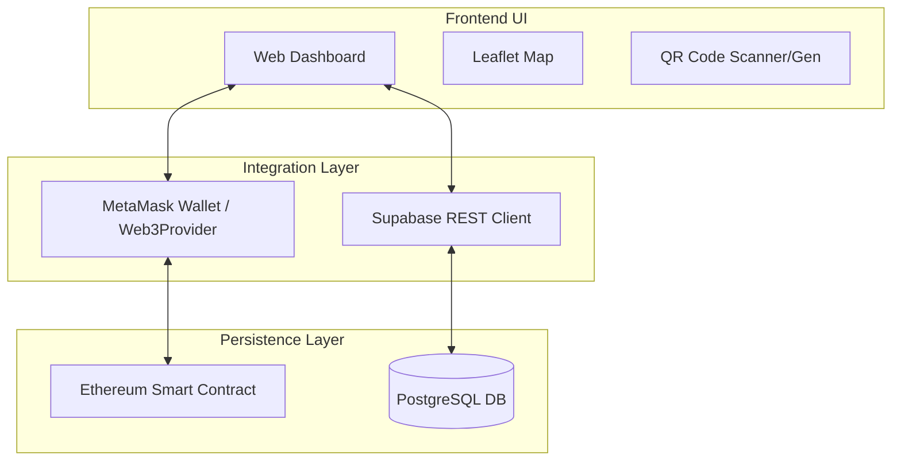
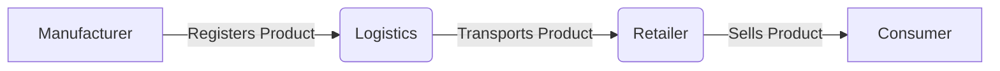
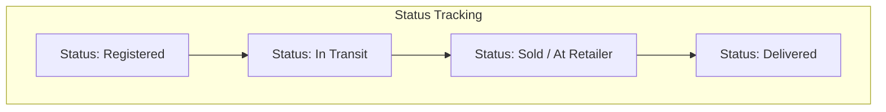
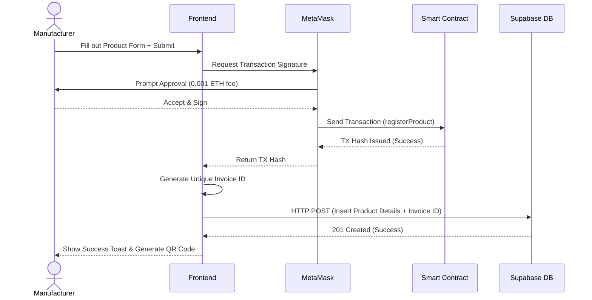

# VeriChain Web Portal - Project Reference Document

This document compiles the essential details of the **VeriChain Web Portal** project, specially formatted for your blackbook/project report preparation. It covers the workflow, technologies, algorithms, and architectural design of the application in detail.

---

## 1. Project Overview
VeriChain is a decentralized application (dApp) designed to track and verify the supply chain of products from manufacturing to final delivery. By combining blockchain technology for immutable record-keeping and a traditional database for fast querying, it provides an end-to-end transparent logistics tracking system.

---

## 2. System Architecture

The application follows a **Hybrid Web3 dApp Architecture**, separating on-chain persistence from off-chain indexing and user interface representation.

1. **Frontend (Client Profile)**: 
   - A single-page application dashboard providing role-based portals (Manufacturer, Logistics, Retailer).
   - Serves as the interface for users to interact with both the blockchain and the backend database.
2. **Blockchain Layer (Smart Contracts & Network)**:
   - Contains the core business logic for immutable product registration.
   - Deployed on an Ethereum-compatible network.
   - Requires payment (0.001 ETH fee) for state changes (e.g., registering a product).
3. **Off-chain Backend (Supabase/PostgreSQL)**:
   - Acts as an indexer and fast-access database.
   - Stores supplementary data that isn't cost-effective for blockchain storage, along with cached states for quick UI rendering (Dashboard charts, maps, and lists).

---

## 3. Technology Stack

### Frontend
* **HTML5 / Vanilla JavaScript**: Core structure and behavior without heavy framework overhead.
* **Tailwind CSS**: Utility-first CSS framework for responsive, modern, dark-themed UI components.
* **Chart.js**: Render interactive data visualizations (Status proportion rings, activity lines).
* **Leaflet.js & OpenStreetMap / CartoDB**: Render geospatial supply chain tracking maps.
* **QRious**: Client-side QR code generation for physically tagging tracked products.

### Backend & Database
* **Supabase**: Backend-as-a-service (BaaS) that provides a managed PostgreSQL database.
* **PostgreSQL**: Relational database storing product details, timestamps, and current lifecycle states.

### Blockchain & Web3
* **Solidity (^0.8.0)**: Object-oriented programming language for writing the `ManufacturerProductRegister` smart contract.
* **Ethers.js / Web3.js**: JavaScript libraries for interacting with the Ethereum blockchain via the frontend.
* **Hardhat**: Development environment for compiling, deploying, testing, and debugging Ethereum standard software.
* **MetaMask**: Crypto wallet standard used to facilitate application interactions and transaction signing.

---

## 4. Supply Chain Workflow

The system simulates a real-world supply chain lifecycle through the following workflow:

### Phase 1: Manufacturing & Onboarding
1. **Data Entry**: The Manufacturer inputs product metadata (ID, Type, Detail, Quantity, Manufacturer Name).
2. **Blockchain Registration**: The portal triggers a MetaMask transaction to the `ManufacturerProductRegister` smart contract (`registerProduct` function). A registration fee of 0.001 ETH is transferred.
3. **Database Sync**: Upon successful transaction, the product record is generated with a unique `Invoice ID` and saved to the Supabase database with the status set to "Registered".
4. **QR Generation**: A QR code representing the unique Product ID is generated for the manufacturer to print and attach to the physical shipment.

### Phase 2: Logistics & Transit
1. **Status Update**: The logistics provider scans the QR code and updates the destination/supplier info in the Logistics tab.
2. **State Change**: The system updates the product's status off-chain to `In Transit` and logs a transfer timestamp. A demonstrative transaction hash is tied to the event.

### Phase 3: Retail & Inventory
1. **Receiving**: The Retailer scans the item upon arrival off the delivery truck. 
2. **Inventory Addition**: The product status is updated to `Sold / At Retailer`.
3. **Verification**: Retailers and Consumers can use the scan feature to pull the full lineage of the product, confirming its origin timestamp and creator.

### Phase 4: Delivery
1. **Final Handoff**: The product is assigned to the final consumer.
2. **Final State**: The product status becomes `Delivered` and the lifecycle block is completed. 

---

## 5. Sequence Diagram: Product Registration

Detailed data flow of how a product is registered onto the system:

---

## 6. Algorithms & Logic Models

Instead of typical computational algorithms (like sorting/searching), VeriChain relies heavily on **State Machine Logic** and **Cryptographic Verification**:

1. **State Progression Algorithm**:
   - The system categorizes product status through hierarchical conditional checking applied in the dashboard calculations:
     - `IF` Delivered -> **Status = Delivered**
     - `ELSE IF` Transferred to Supplier `OR` Sold -> **Status = In Transit**
     - `ELSE` -> **Status = Registered**
   
2. **Smart Contract Indexing Logic**:
   - Auto-incrementing product ID indexer (`productCount++`) tracks total issuance globally.
   - `Mapping (uint256 => Product)` creates an O(1) lookup table for product verification on-chain.
   
3. **Unique Invoice Algorithm**:
   - Generates collision-resistant identifiers without relying on central database auto-increments.
   - `INV-VRC-{Date.now()}-{Random Base36 Suffix}` guarantees distinct identifiers for parallel operations.

4. **Cryptographic Hashing & Wallets (Underlying Web3)**:
   - **ECDSA (Elliptic Curve Digital Signature Algorithm)** is used implicitly via MetaMask for transaction signing.
   - **Keccak-256** hashing verifies data integrity within the Solidity environment.
